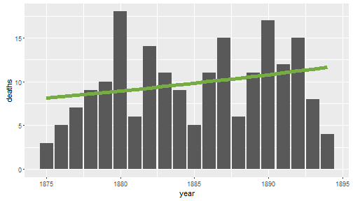

The von Bortkiewicz Data Set
========================================================
author: Charles Eliot
date: September 2016
autosize: true

The von Bortkiewicz Data Set
========================================================

- deaths from horse kicks in 14 Prussian Army corps from 1875-1894
- published in 1898 by Ladislaus von Bortkiewicz
- an early example of using a Poisson distribution to model rare events


Getting the data
========================================================


```r
library(vcd)
data("VonBort")
```

Sample data analysis
========================================================

This plot shows the total number of deaths per year, summed over all 14 corps. The green trend line is based on a Poisson GLM model, and shows that the rate of deaths from horse-kicks increased by approximately 1.9% per year.



```
[1] "Per-year rate of increase: 1.89%"
```

Shiny web site
========================================================

If you want to experiment with the von Bortkiewicz data set, visit this Shiny web application:

https://charleseliot.shinyapps.io/VonBort/
